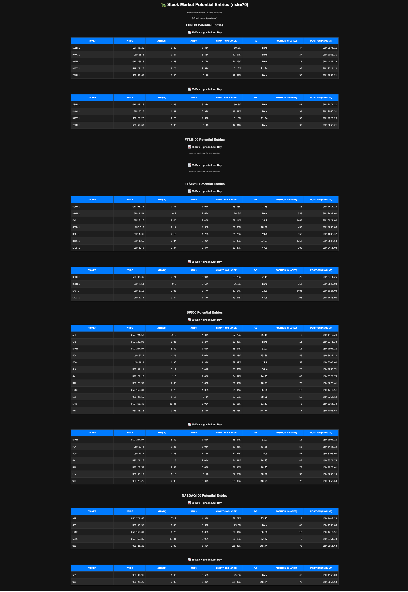

# Papishares

A real-time trading portfolio management and risk monitoring system built with Flask, designed to integrate with Trading 212's API for active position tracking, technical analysis, and automated risk management.


## Overview

Papishares is a production-grade trading tool that provides real-time visibility into portfolio positions, calculates dynamic stop losses based on risk parameters, monitors technical indicators, and sends automated alerts when trading signals occur. Built to solve the challenge of maintaining disciplined risk management across multiple concurrent positions.

## Key Features

### 📊 Real-Time Position Tracking
- Live position monitoring via Trading 212 API integration
- Real-time P&L calculations with percentage returns
- Multi-currency support (USD, GBP, GBX) with automatic conversion handling
- Tracks purchase price, current price, and historical maximum price for each position

### 🎯 Intelligent Stop Loss Management
- **Dynamic stop loss calculation** based on configurable risk percentage (default: 0.7% per position)
- Automatically adjusts stop losses as positions move in your favor (trailing stops)
- Visualizes stop loss distance from current price for quick risk assessment
- Tracks both calculated and manually-set stop losses
- **Auto-sell capability**: Optional automated order execution when stop losses are triggered (weekday only)

### 📈 Technical Analysis Integration
- **MACD (Moving Average Convergence Divergence)** analysis with Yahoo Finance data
  - Bullish/Bearish signal detection
  - Crossover identification (when MACD crosses signal line)
  - Real-time notifications when technical signals change
- **Simple Moving Average (SMA)** tracking (17-day default)
- Visual indicators showing current price position relative to technical levels

### 🚨 Smart Alerting System
- Telegram bot integration for instant notifications
- Alerts triggered on:
  - Stop loss activations
  - MACD crossover events (bullish/bearish)
  - Technical indicator changes
- Intelligent deduplication prevents notification spam
- Persistent notification tracking in SQLite database

### 💰 Portfolio Risk Analytics
- **Total portfolio risk calculation**: Shows aggregate risk exposure across all positions
- Visualizes what percentage of total capital would be lost if all stop losses triggered simultaneously
- Configurable total risk threshold (default: 7% of account value)
- Per-position risk breakdown

### 📋 Entry Signal Dashboard
- Displays potential entry candidates based on Turtle Trading methodology
- Identifies stocks/funds hitting 20-day and 55-day highs
- Fetches pre-calculated entry signals from external data source
- Separate view for new position opportunities



### 🔧 Production-Ready Infrastructure
- **Containerized deployment** with Docker
- **Kubernetes/Helm deployment** with full chart configuration
- Persistent storage via SQLite with automatic schema management
- Health check endpoints (`/healthz`, `/readyz`) for orchestration
- Ingress configuration with TLS support
- Rate limiting protection for API calls
- Automatic cleanup of stale position data

## Technical Architecture

### Core Components

**Backend**: Flask web application (Python)
- RESTful API design with JSON responses
- Asynchronous data fetching with rate limit handling
- SQLite for persistent state management

**Data Sources**:
- Trading 212 API for live position and order data
- Yahoo Finance (yfinance) for historical price data and technical indicators
- External JSON feed for entry signal generation

**Storage**:
- SQLite database tracking:
  - Position max prices and stop losses
  - MACD notification history (prevents duplicate alerts)
  - Feature flags (e.g., auto-sell toggle)
- Kubernetes PersistentVolumeClaim for data persistence

**Notifications**:
- Telegram Bot API for real-time alerts
- Configurable chat ID for targeted messaging

### API Endpoints

| Endpoint | Method | Description |
|----------|--------|-------------|
| `/` | GET | Main dashboard view (positions table) |
| `/positions` | GET | JSON of all current positions with analytics |
| `/orders` | GET | Pending limit and market orders |
| `/entries` | GET | Turtle trading entry signals |
| `/autosell` | POST | Toggle auto-sell feature |
| `/healthz` | GET | Health check for liveness probe |
| `/readyz` | GET | Readiness probe endpoint |

### Data Model

**Position Object**:
```json
{
  "ticker": "AAPL",
  "short_name": "AAPL",
  "name": "Apple Inc.",
  "currency": "USD",
  "quantity": 50,
  "average_price": 150.25,
  "current_price": 155.80,
  "profit_pct": 3.69,
  "max_price": 158.00,
  "stop_loss_price": 149.20,
  "stop_loss_percentage": 0.70,
  "manual_stop_loss_price": null,
  "manual_stop_loss_quantity": 0,
  "macd_signal": "BULLISH",
  "macd_crossover": null,
  "sma_17": 152.45
}
```

## Installation & Deployment

### Prerequisites
- Trading 212 API credentials (API key and secret)
- (Optional) Telegram bot token and chat ID
- Docker and Kubernetes cluster (for containerized deployment)

### Environment Variables

Create a `.env` file:
```bash
# Trading 212 API
T212_API_BASE="https://live.trading212.com/api/v0/equity"
T212_API_KEY="your_api_key_here"
T212_SECRET_KEY="your_secret_key_here"

# Telegram Notifications (optional)
TELEGRAM_BOT_TOKEN="123456789:ABCdefGHIjklMNOpqrsTUVwxyz"
TELEGRAM_CHAT_ID="987654321"

# Database
DB_PATH="./papishares.db"
```

### Local Development

```bash
# Install dependencies
pip install -r requirements.txt

# Run the application
python app.py

# Access at http://localhost:5000
```

### Docker Deployment

```bash
# Build the image
docker build --platform linux/amd64 -t ophintor/papishares:latest . --push

# Run container
docker run -p 5000:5000 \
  --env-file .env \
  -v $(pwd)/data:/data \
  ophintor/papishares:latest
```

### Kubernetes/Helm Deployment

```bash
# Install the Helm chart
helm upgrade --install \
  papishares ./chart \
  --namespace papishares \
  --create-namespace \
  --set env.t212_api_key=$(cat .env | grep T212_API_KEY | cut -f2 -d'=') \
  --set env.t212_secret_key=$(cat .env | grep T212_SECRET_KEY | cut -f2 -d'=') \
  --set env.t212_api_base=$(cat .env | grep T212_API_BASE | cut -f2 -d'=') \
  --set env.telegram_bot_token=$(cat .env | grep TELEGRAM_BOT_TOKEN | cut -f2 -d'=') \
  --set env.telegram_chat_id=$(cat .env | grep TELEGRAM_CHAT_ID | cut -f2 -d'=')
```

The Helm chart includes:
- Deployment with configurable replicas
- Service (ClusterIP)
- Ingress with TLS support
- PersistentVolumeClaim for SQLite database
- Secret management for API credentials
- Health check probes
- Optional HorizontalPodAutoscaler

## Configuration

### Risk Management Parameters

Edit `papishares.py` to adjust risk thresholds:

```python
RISK_PERCENTAGE = 0.7  # Risk per position (0.7% of account)
TOTAL_RISK_PERCENTAGE = 7.0  # Maximum total portfolio risk
```

### Technical Indicator Settings

Customize technical analysis parameters:

```python
# MACD settings
calculate_macd(df, fast_period=12, slow_period=26, signal_period=9)

# SMA period
get_sma(symbol, days=17)
```

### Auto-Sell Feature

Toggle automated stop loss execution:
- Send POST request to `/autosell` endpoint
- Or use the web interface toggle
- Status persists in database across restarts
- Only executes on weekdays to avoid weekend volatility

## How It Works

### Position Monitoring Flow

1. **Data Collection**: Fetches current positions from Trading 212 API
2. **Price Updates**: Gets real-time prices for each ticker
3. **Stop Loss Calculation**:
   - Calculates risk-based stop loss (risk amount / quantity)
   - Uses the higher of purchase price or historical max price as basis
   - Adjusts for currency (GBX prices are divided by 100)
4. **Technical Analysis**:
   - Fetches historical data from Yahoo Finance
   - Calculates MACD and SMA indicators
   - Detects crossovers and signal changes
5. **Risk Aggregation**: Sums total portfolio risk exposure
6. **Notification Handling**:
   - Checks database for previous notifications
   - Sends new alerts via Telegram when conditions met
   - Records notification to prevent duplicates
7. **Auto-Sell Execution** (if enabled):
   - Monitors current price vs stop loss
   - Executes market sell order when triggered
   - Sends confirmation notification

### Database Schema

**positions table**:
- `ticker` (PRIMARY KEY): Stock ticker symbol
- `max_price`: Historical maximum price reached
- `stop_loss`: Calculated stop loss price

**macd_notifications table**:
- `symbol` (PRIMARY KEY): Stock symbol
- `last_crossover_type`: BULLISH or BEARISH
- `last_crossover_time`: When crossover occurred
- `last_notified_time`: When notification was sent

**flags table**:
- `flag` (PRIMARY KEY): Feature flag name (e.g., "auto_sell")
- `status`: Boolean flag state

## Use Cases

### Active Day Trading
- Monitor multiple positions with real-time P&L
- Quick visual assessment of stop loss distances
- Automated alerts when technical signals change

### Swing Trading
- Track positions over days/weeks
- Trailing stop losses automatically adjust as prices rise
- MACD crossovers signal potential exits

### Risk Management
- Ensure total portfolio risk stays within limits
- Visualize aggregate exposure across positions
- Automated stop loss execution for discipline

### Portfolio Analysis
- Historical max price tracking shows missed profit opportunities
- Technical indicator overlay reveals optimal entry/exit points
- Entry signal dashboard identifies new opportunities

## Technical Highlights

- **Rate Limit Handling**: Implements exponential backoff and retry logic for API calls
- **Currency Normalization**: Handles GBX (pence) to GBP conversion automatically
- **Error Resilience**: Graceful handling of missing data, API failures, and edge cases
- **State Persistence**: SQLite ensures stop loss and notification state survives restarts
- **Idempotency**: Notification deduplication prevents alert spam
- **Production Patterns**: Health checks, structured logging, containerization, K8s-ready

## Future Enhancements

Potential additions:
- Historical P&L charting and performance analytics
- Options and futures support
- Backtesting framework for entry/exit strategies
- Multi-account aggregation
- Advanced order types (OCO, trailing stop limits)
- Web-based configuration UI
- Export to CSV/Excel for tax reporting

## License

Personal project - use at your own risk. Not financial advice.

## Contributing

This is a personal trading tool, but contributions and suggestions are welcome. Open an issue or submit a pull request.

---

**Disclaimer**: This tool is for personal use and educational purposes. Trading involves substantial risk. Always verify trades manually and understand the code before enabling automated features like auto-sell.
