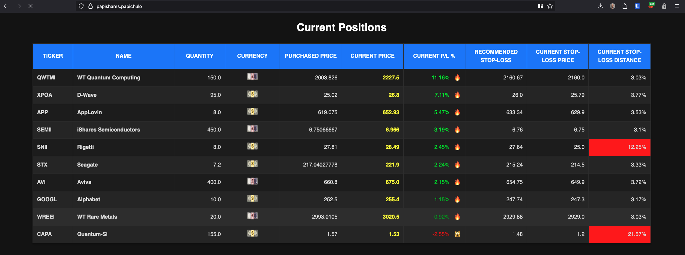

# Papishares
This is a homemade app, created for my own enjoyment, but feel free to use it or
get some inspiration out of it. It just lists my current open positions in
Trading 212 in a webpage. It mainly helps me visualise my stop losses, so I can
keep them at a safe distance.



## Build the docker image

```
docker build --platform linux/amd64 -t ophintor/papishares:latest . --push
```

## Install the helm chart

Last two are optional.

```
helm upgrade --install \
  papishares ./chart \
  --namespace papishares \
  --create-namespace \
  --set env.api_key=$(cat .env | grep API_KEY | cut -f2 -d'=') \
  --set env.api_base=$(cat .env | grep API_BASE | cut -f2 -d'=') \
  --set env.bot_token=$(cat .env | grep BOT_TOKEN | cut -f2 -d'=') \
  --set env.chat_id=$(cat .env | grep CHAT_ID | cut -f2 -d'=')
```

# You need an .env file

Containing something like:

```
# Tarding 212
API_BASE="https://live.trading212.com/api/v0/equity"
API_KEY="<your trading 212 API key>"
# Only for Telegram
BOT_TOKEN="999999999:xxxxxxxxxxxxxxxxxxxxxxxxxxxxxxxxxxx"
CHAT_ID="222222222"
```

The telegram stuff is only for notifications, and requires you to create your
own Telegram bot.
